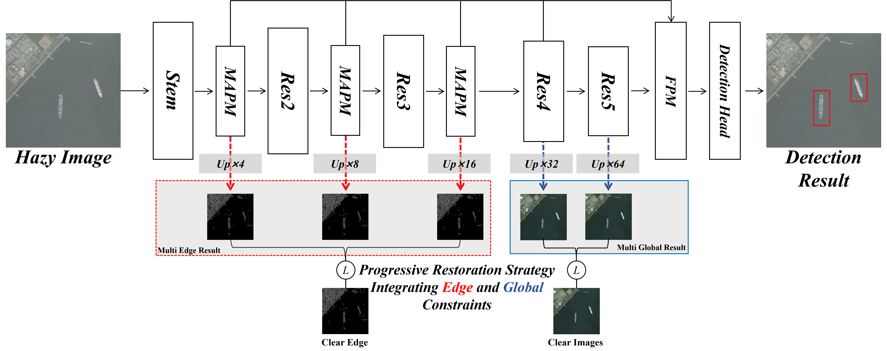

# IEGC-FSDN

Official repository for **IEGC-FSDN: Foggy Ship Detection Network with Integrating Edge and Global Constraints**.

IEGC-FSDN is designed for ship detection in foggy remote-sensing images. It integrates progressive edge/global constraints and a Multi-Scale Atmospheric Prior Module (MSAPM) into a detection framework to improve robustness under haze degradation, especially for small ships and detail-sensitive targets.

Additional project materials and the newly constructed real foggy ship dataset will be updated in this repository.

## Highlights

- **Progressive Restoration Strategy (PRS)**: applies local edge constraints at high-resolution stages and global constraints at low-resolution stages to refine haze-degraded detection features.
- **Multi-Scale Atmospheric Prior Module (MSAPM)**: injects atmospheric physical priors into multi-scale detection features for haze-robust representation learning.
- **Synthetic and real foggy evaluation**: experiments are conducted on a synthetic foggy ship dataset and a newly constructed real foggy ship dataset containing 1,348 foggy remote-sensing images.
- **Efficient design**: improves detection performance with only a small increase in parameters and inference time.

## Method Overview

IEGC-FSDN is built on a diffusion-based detection framework. The network progressively enhances fog-corrupted features by combining:

1. edge-aware supervision for high-resolution feature stages,
2. global structural constraints for low-resolution feature stages,
3. multi-scale atmospheric priors for haze-aware feature enhancement.

The overall architecture is shown below:

## Experimental Results

### Comparison on Foggy Ship Detection

| Strategy | Method | Syn. mAP | Large | Medium | Small | Real mAP |
| --- | --- | ---: | ---: | ---: | ---: | ---: |
| Direct | Faster R-CNN | 58.905 | 48.0 | 65.3 | 52.9 | 11.862 |
| Direct | Sparse R-CNN | 59.316 | 47.9 | 65.7 | 54.0 | 12.955 |
| Direct | DiffusionDet | 61.183 | 49.6 | 67.9 | 56.5 | 12.612 |
| Distributed | ACE | 61.548 | 48.7 | 67.5 | 55.2 | 13.857 |
| Distributed | DCP | 61.799 | 51.3 | 67.7 | 55.1 | 14.127 |
| Distributed | AOD | 63.084 | 51.3 | 69.7 | 57.5 | 13.567 |
| Distributed | GridDehaze | 62.350 | 50.4 | 69.1 | 57.0 | 12.986 |
| Union | CascadeNet | 61.815 | 49.8 | 71.1 | 60.3 | 13.276 |
| Union | IA-YOLO | 58.285 | 45.6 | 64.6 | 53.2 | 10.481 |
| Union | DSNet | 63.569 | 44.6 | 68.9 | 57.3 | 12.035 |
| Union | BADNet | 63.763 | 50.9 | 70.5 | 59.3 | 12.298 |
| Union | MASFNet | 64.339 | 52.1 | 71.1 | 60.8 | 12.109 |
| Union | IEGC-FSDN | **66.395** | **54.8** | **72.5** | **61.5** | **15.198** |

### Ablation Study

| Method | mAP | Large | Medium | Small |
| --- | ---: | ---: | ---: | ---: |
| Baseline | 61.183 | 49.6 | 67.9 | 56.5 |
| PRS only | 65.446 | 52.2 | 71.9 | 60.6 |
| MSAPM only | 63.111 | - | - | - |
| IEGC-FSDN | **66.395** | **54.8** | **72.5** | **61.5** |

## Dataset

The experiments use both synthetic foggy ship images and real foggy ship images.

- **Synthetic foggy ship dataset**: contains 14,920 training images and 4,974 testing images. Fog-degraded samples are generated from ship instances collected from public remote-sensing object detection datasets such as DOTA and HRSSD.
- **Real foggy ship dataset**: contains 1,348 real foggy remote-sensing images with a spatial size of 512 x 512.

The real foggy ship dataset will be released together with the source code.

## Contact

For questions, please contact:

- Yu Wan: 2024282140091@whu.edu.cn
- Project page: <https://github.com/KIKYOUWY/IEGC-FSDN>
